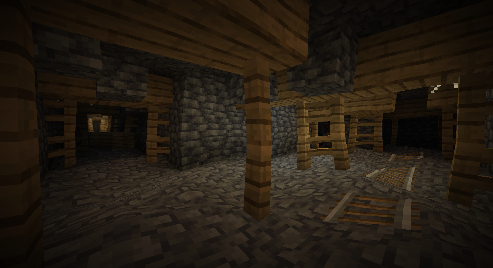
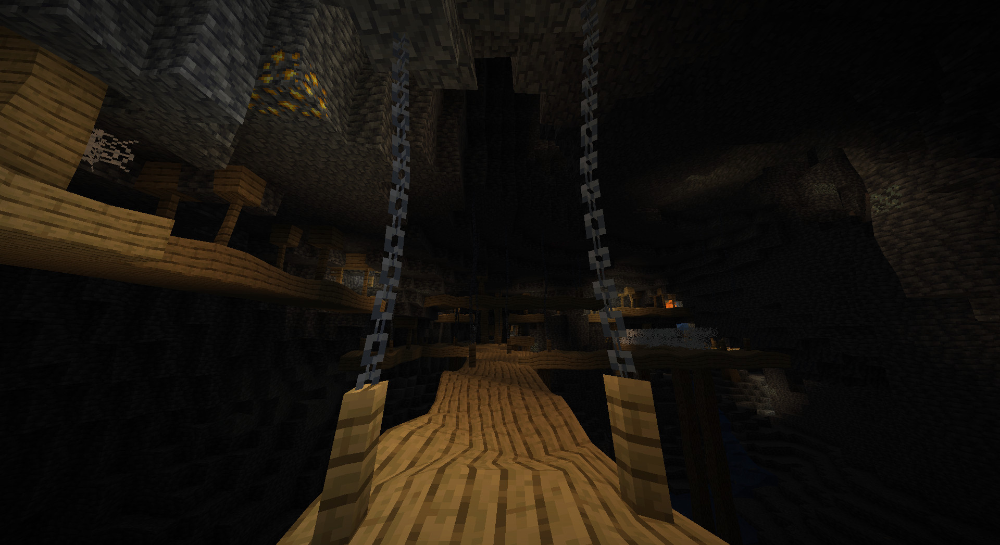
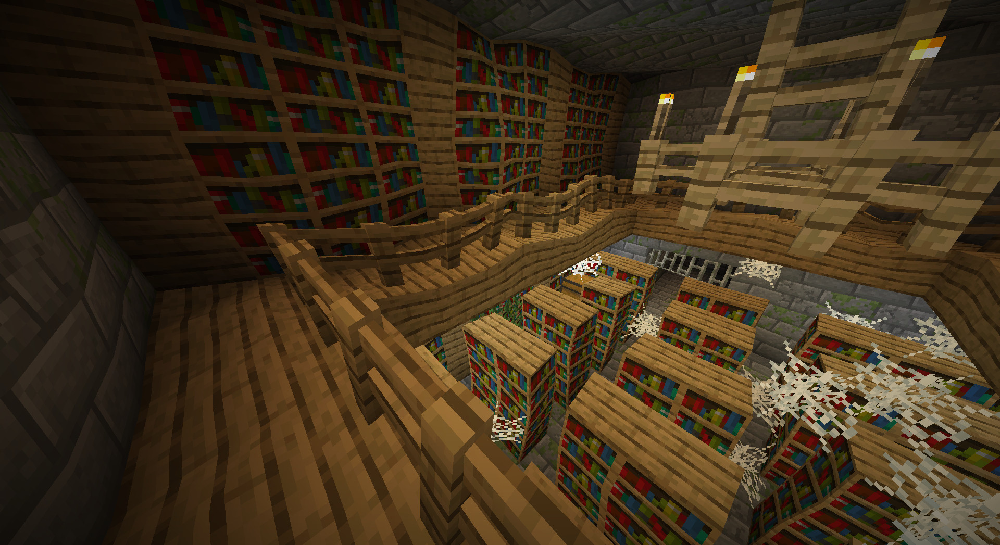
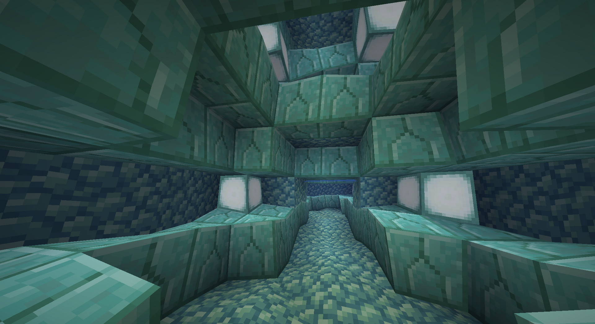
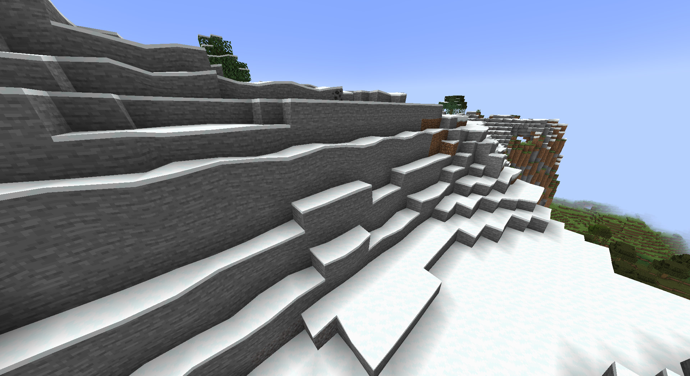
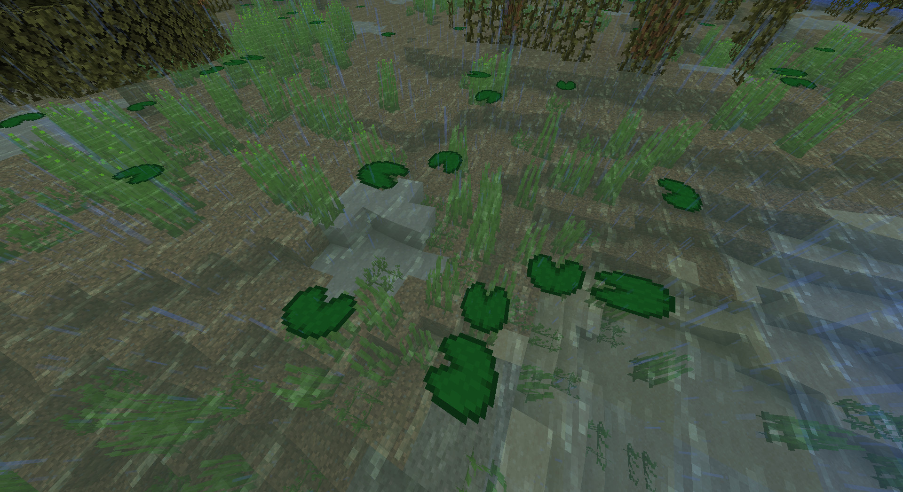
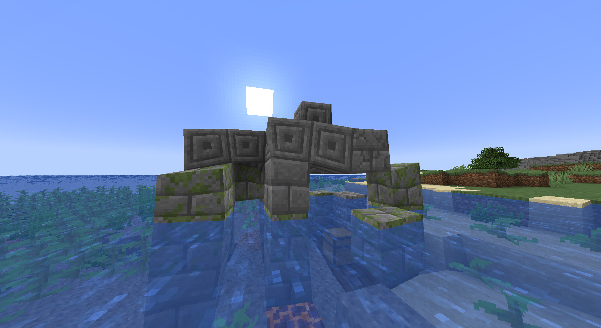
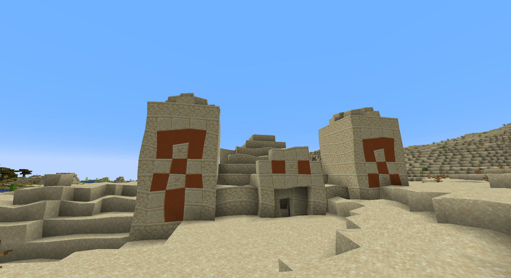

# Cavern Shader Resource Pack #
This little shader subtly throws the corners of blocks around a bit to give the world a more dynamic, caverny, retro-3d-style look. No more straight edges!

## Requirements ##
Minecraft 1.18+?  
Works on Vanilla

## Install ##
Place the CavernShader folder into your resourcepack folder, located in the `.minecraft` folder. You can find it by pressing `Resource Packs...` in the game options and press `Open  Pack Folder`. After you placed the CavernShader folder there, it should be available in the `Resource Packs...` list in your game.

## Screenshots ##
&nbsp;                                        | &nbsp;  
:--------------------------------------------:|:---------------------------------------------:
                   | 
 | 
             | 
               | 


## How it works ##
The cavern vertex shader runs through rendertype_cavy.vsh. Here, each point is calculated through a series of sines and cosines with random values.

```
vec3 Disposition = vec3(
    sin(AlignedPosition.x * 1.3 - AlignedPosition.z * 0.7 + 0.0) * (0.6 + sin(AlignedPosition.y * 1.3 + 1.0)) * 0.12,
    sin(AlignedPosition.x * 1.1 + AlignedPosition.z * 1.5 + 3.0) * (0.6 + cos(AlignedPosition.y * 1.5 + 0.0)) * 0.12,
    cos(AlignedPosition.x * 0.7 + AlignedPosition.z * 1.4 + 7.0) * (0.6 + sin(AlignedPosition.y * 1.2 + 9.0)) * 0.12
);
```

You can alter these values as you see fit to get different results. Displace, amplify, or increase frequency of the waves over the x, y, and/or z axis. There is no special meaning behind this formula, it just came out right for me through trial and error.

The line above that:
```
vec3 AlignedPosition = mod(abs(Position), 16) * sign(Position);
```
Makes sure that the positions at the chunk borders always take on the same positions so they align with the next chunk.

## Can I use this shader for [insert reason] ##
Yes, use it as you please. No need for my permission. 
A credit would be kind: 'Cavern Shader made by Joozey'.